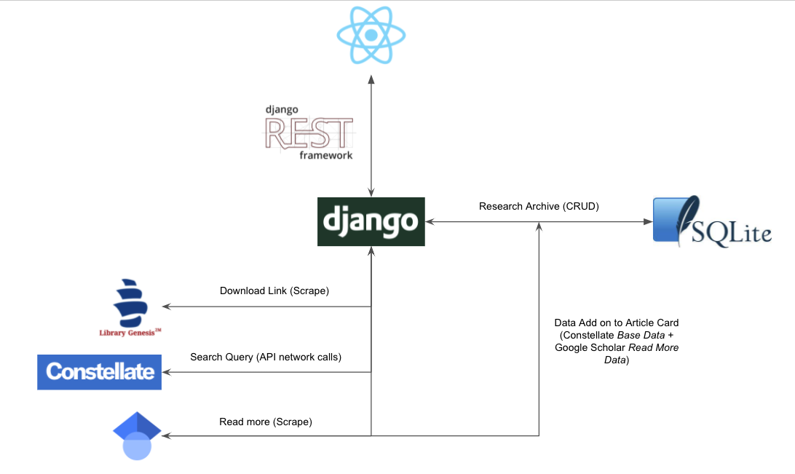

# Pilot 

### What is it? 

Project Pilot is a take on JSTOR's constellate API, merging the functionalities of Google Scholar and Library Genesis, to allow users to browse and download research papers for free on demand, on top of other additional features. 

The main objective for this project is for me to practice and dive deeper into some of the inner workings of React and Django, with the secondary objective to reduce the inconvenience of searching for a mirror download on Library Genesis everytime an interesting paper is surfaced. 

### 🏗 Architecture and Project Files

The relevant files for the backend is located under: 
```
backend/backend/ 
backend/research/ 
```
The relevant files for the frontend is located under:
```
frontend/src/components
frontend/src/functions
frontend/src/pages
frontend/src/styles
```


### Features

##### Query
- Categorical Filtering of Research Articles 
- Visualisation of Articles Published over time x category for search query [ Absolute / Percentage(%) ]
- Visualisation of Categorical Breakdown of search query
- Read more card that scrapes citations and abstracts from google scholar

##### Downloading
- Direct link to Library Genesis for instant download

##### Achives
- Allow CRUD of personal articles
- Visualisation of articles added into archives over time 
- Visualisation of categories within archives 
- Sort by date articles is added 
- Allow browsing of archived articles by category 

##### Easter optimisations 
- Caching of last queried and queried results in local storage to reduce API overheads and rate limits
- Backend scraping to reduce CORS issues that are hard to overcome with axios
- Clear all in categorical filters 

### Upcoming Features and known Bugs

##### Upcoming Features
- Allow for instant popping of article cards (Redux)
- Implement TOR Scraping for GScholar

#### Upcoming Fixes
- Categorical bar charts should exclude parent category - E.g. under history lies “History” and “Historical Methodology”
- Date filtering not working reliably
- Remove from archives randomly appears even though article is not archived


# 🚀 Quick Start 

Create virtual environment
```zsh
cd heron
python3 -m venv venv
source venv/bin/activate 
```
Start up backend 
```zsh
cd backend 
pip3 install -r requirements.txt ## Install python dependencies
python3 manage.py makemigrations 
python3 manage.py migrate ## Set up django db models
python3 manage.py runserver 8000 ## Start up backend server on port 8000
```
Set up .env files required for front end. In .env
```
REACT_APP_CONSTELLATE_ID=[Your UUID] ### To get your uuid, Inspect -> Network -> Fetch/XHR -> Request Headers -> Authorization -> 'UUID ....'
REACT_APP_BASE_URL=http://localhost:8000/api ### The port your backend runs on
```
Start up frontend
```zsh
### Make sure you have Node >= 14.0.0 and npm >= 5.6 on your machine
npm init ## Install Node Dependencies
npm start ## Start up front end server
```